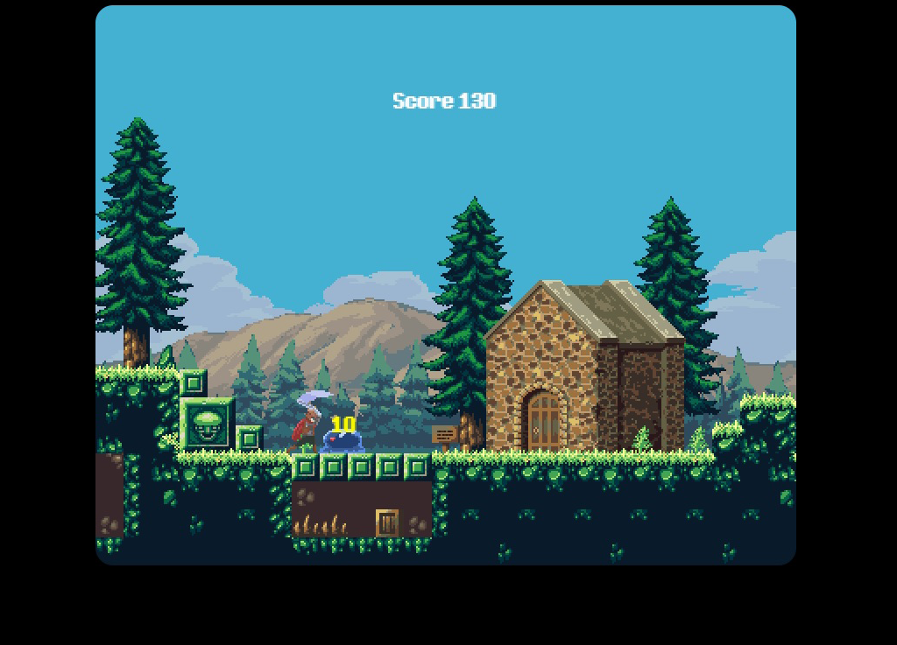

# Prince Fantasy RPG
RPG game for microverse capstone project

# Live version

[Prince Fantasy RPG](https://musing-chandrasekhar-82e3c9.netlify.app/)

# Contributing 

if you want to contribute to this project send me an email at [cecibenitezca@gmail.com],
maybe I can send you an invite and you become a collaborator.

# Find the assets here

[player](https://rvros.itch.io/animated-pixel-hero)

[map](https://vnitti.itch.io/taiga-asset-pack)

[more](https://itch.io/game-assets/free)

# About 

This demo shows how collision detection can be implemented based on not only the collision itself but distance during the collision and direction of the object facing. And also how an API can be used to store players data. In the demo you get points when you hit the "punching bag" slime. To exit you can just press the ESC key and submit your score.

This is a demo for physics implementation, events and scene reloading/handling. Don't expect a full game.

# How to run locally

* Simply clone the project run `npm install` and `npm run build`
* Open the generated index.html on the dist folder. 

# Instructions
You have to collect all coins and kill the slime, then look at your score and submit it.

* Use ESC to open the menu and submit your score
* Use the Arrow keys for movement
* Use up arrow to jump
* Hold space bar for attack

# Validations

- eslint
- jest for testing

# Get Started

Simply clone the project and run `npm install` && `npm run build`

# Features

* A fully functional action RPG template
* ES6
* Animations
* Functional High Scores Board
* Collision Detection based on direction  
* Jest Test

# Built With

* `Phaser` 
* `CSS` 
* `Webpack` 
* `Javascript`
* `ES6`
* `Babel`
* `npm`

# Author

* [Cecilia Benitez](https://github.com/Ceci007)

# License

This project is licensed under the MIT License

